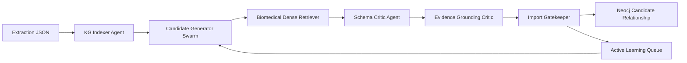

# Entity Linking Preflight 设计与运行说明

这个 preflight 层解决的问题是：LLM 已经抽出了实体和关系，但在写入 Neo4j 前，需要先判断实体端点是否能链接到目标图数据库中已有的核心节点。它是只读流程，不写 Neo4j。

## 已实现内容

脚本：

```text
entity_linking_preflight.py
```

当前实现是一个 schema-aware ensemble linker：

1. `Indexer Agent`：从 Neo4j 只读导出 `Gene/Protein/Metabolite/Pathway/Disease/Tissue/CellType` 核心节点索引，并缓存到本地。
2. `Exact Matcher`：用 KG 主键、name、gene symbol、NCBI Gene ID、HMDB ID、KEGG/Reactome pathway ID 做精确匹配。
3. `Lexical Matcher`：做大小写、标点、Greek 字母、pathway 后缀等规范化后的 fuzzy/containment 匹配。
4. `Alias Hint Matcher`：补少量高价值 biomedical alias，例如 `Nrf2 -> NFE2L2`、`PAR-1 -> F2R`。
5. `Schema Repair Critic`：在关系层根据目标 schema 尝试类型修正，例如把被错标成 `Protein` 的 `EGFR` 修到 `Gene`，但只作为候选，不直接改原始抽取。
6. `Gatekeeper`：只有 predicate、schema、质量 flags、两端实体链接都通过时，才标为 `import_candidate`。

## 运行方式

先设置 Neo4j 密码：

```bash
cd /Users/a1234/FYP/liver_disease_kg_project
export NEO4J_PASSWORD="<本地密码>"
```

首次运行或需要刷新索引：

```bash
python3 entity_linking_preflight.py \
  --input extraction_output/extraction_results_schema_compliant_llm_probe_v5_20260627.json \
  --run-id v5_preflight_v3 \
  --refresh-index
```

已有缓存后运行：

```bash
python3 entity_linking_preflight.py \
  --input extraction_output/extraction_results_pubmed_quality_test_20260627.json \
  --run-id pubmed10_preflight_v3
```

输出目录：

```text
extraction_output/entity_linking_preflight/
```

主要输出：

| 文件 | 说明 |
| --- | --- |
| `<run-id>_linked_extraction_results.json` | 带实体候选和关系 preflight 结果的抽取结果 |
| `<run-id>_preflight_report.json` | 机器可读总报告 |
| `<run-id>_preflight_report.md` | 人可读方法对比和 review 样例 |
| `<run-id>_entity_candidates.jsonl` | 每个实体的最佳链接候选 |
| `<run-id>_relation_preflight.jsonl` | 每条关系的端点链接和 gate 决策 |

## 当前测试结果

最新 schema-compliant 小样本：

```bash
python3 entity_linking_preflight.py \
  --input extraction_output/extraction_results_schema_compliant_llm_probe_v5_20260627.json \
  --run-id v5_preflight_v3
```

结果：

| 方法 | 实体链接 | 两端可链接关系 | import candidates |
| --- | ---: | ---: | ---: |
| exact | 12/25 | 1/14 | 0 |
| lexical | 14/25 | 1/14 | 0 |
| ensemble | 14/25 | 1/14 | 0 |

10 篇 PubMed 旧质量测试结果：

```bash
python3 entity_linking_preflight.py \
  --input extraction_output/extraction_results_pubmed_quality_test_20260627.json \
  --run-id pubmed10_preflight_v3
```

结果：

| 方法 | 实体链接 | 两端可链接关系 | import candidates |
| --- | ---: | ---: | ---: |
| exact | 22/82 | 1/74 | 0 |
| lexical | 26/82 | 2/74 | 0 |
| ensemble | 26/82 | 2/74 | 0 |

正例控制测试：

```bash
python3 entity_linking_preflight.py \
  --input extraction_output/entity_linking_preflight_positive_control.json \
  --run-id positive_control_preflight_v2
```

结果：`TP53 -> HCC` 被正确识别为 1 条 `import_candidate`。这说明 gate 能放行真正符合 schema、质量和端点链接要求的关系。

## 当前发现

preflight 改善了实体端点可见性，但没有把当前 PubMed 样本变成可导入关系。原因不是链接器太保守，而是样本和目标 schema 本身存在错位：

- 当前目标库只有 5 个 Disease 节点，`hepatitis B virus`、`cardiac allograft vasculopathy` 等对象不在库中。
- 当前 HMDB Metabolite 节点只有 36 个，`anthocyanins`、`ferulic acid`、`coumarin` 等常见 abstract chemical 不在目标库中。
- 很多旧抽取结果使用 `TREATS`、`TARGETS`、`BIOMARKER_OF`，这些不属于目标 schema。
- `Pathway -> Disease`、`Protein -> Disease` 在文本里常见，但目标库不允许直接写。
- `p38 MAPK` 没有被链接到 MAPK14，因为当前 KG 中没有 MAPK14 核心节点；脚本不会用 Protein annotation 的文本命中来制造假实体链接。

因此，下一步不是简单放宽阈值，而是扩充实体词典/节点覆盖，并改善上游 PubMed 采样。

## 前沿 Agent 架构建议

可以把当前脚本升级成一个多 agent 的 Link-Then-Import 系统：



推荐分层：

1. `KG Indexer Agent`
   - 定期导出 Neo4j core node index。
   - 为 Gene 加 NCBI/HGNC alias，为 Metabolite 加 HMDB synonym/InChIKey/ChEBI/KEGG Compound，为 Pathway 加 KEGG/Reactome synonyms。

2. `Candidate Generator Swarm`
   - `exact-id`：NCBI Gene、HMDB、KEGG/Reactome ID。
   - `symbol-alias`：gene symbol、protein name、disease alias。
   - `lexical`：规范化 fuzzy。
   - `schema-repair`：根据关系 schema 修正错标类型。
   - `abbreviation-expander`：从 abstract 局部上下文识别 `full name (ABBR)`。

3. `Biomedical Dense Retriever`
   - 用 BioSyn/SapBERT 风格的 synonym representation 做 top-k rerank。
   - 只 rerank 候选，不直接创造 KG 中不存在的节点。

4. `Schema Critic Agent`
   - 判断候选实体类型是否能让关系落入目标 schema。
   - 对 `Pathway -> Disease`、`Protein -> Disease` 等 schema gap 输出 schema-extension proposal，而不是硬塞进现有关系。

5. `Evidence Grounding Critic`
   - 检查 evidence 是否真实支持关系。
   - 区分 novel finding vs background knowledge。

6. `Import Gatekeeper`
   - 只有高置信、非歧义、质量 flags 通过、端点已存在、schema 通过才写库。
   - 其余进入 active learning queue，供人工确认或 schema 扩展。

## 可借鉴的前沿方法

- [BioSyn](https://aclanthology.org/2020.acl-main.335/)：用 synonym marginalization 学 biomedical entity representation，适合补足 HMDB/疾病/化学实体的同义词缺口。
- [SapBERT](https://aclanthology.org/2021.naacl-main.334/)：用 UMLS synonym 自对齐训练实体表示，适合作为 dense entity linker/reranker。
- [BERN2](https://pmc.ncbi.nlm.nih.gov/articles/PMC9563680/)：把 biomedical NER 和 normalization 组合成工具链，可作为外部对照或弱监督来源。
- [BioRED](https://pmc.ncbi.nlm.nih.gov/articles/PMC9487702/)：强调 PubMed abstract 中多类型实体关系和 novel/background 区分，适合改进 evidence critic 与 relation sampling。

## 下一步建议

优先做三件事：

1. 扩充实体词典和核心节点覆盖。
   - Gene：补 HGNC/NCBI alias 到 `NCBIGene:*`。
   - HMDB：至少把 PubMed 样本中出现的 chemical/metabolite 做 HMDB/ChEBI/KEGG Compound 映射。
   - Pathway：补 Reactome/KEGG alias，避免只靠名称 fuzzy。

2. 增加 dense reranker。
   - 当前脚本是 lexical ensemble，适合作为 baseline。
   - 下一版可以加 `--embedding-reranker sapbert`，离线生成 KG alias embedding，再对 mention top-k rerank。

3. 调整 PubMed 采样。
   - 优先 gene-disease、prognosis、expression、protein interaction abstract。
   - 减少治疗综述、网络药理、草药/提取物研究，除非先扩展 `TREATS/TARGETS` schema。
