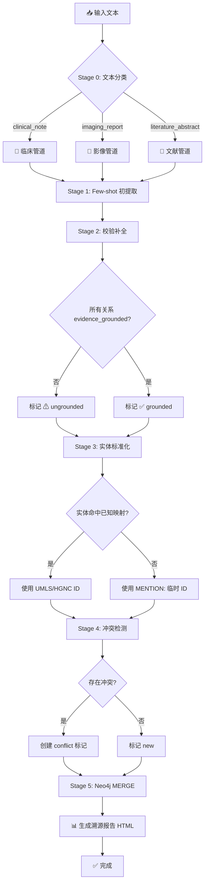
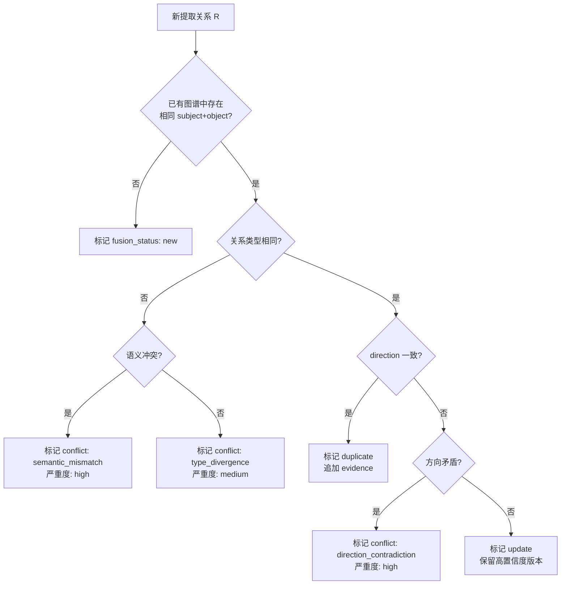
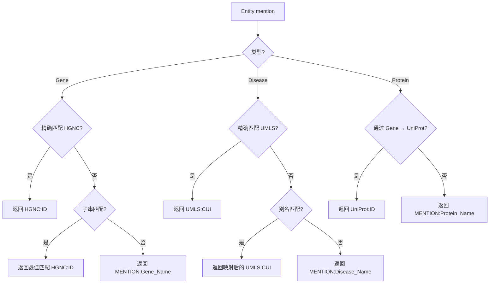

# Multi-Stage LangExtract Agent for Liver Disease Knowledge Graph

## 技术设计文档 v1.0

**项目**: Biomedical Knowledge Graph Construction for Liver Disease Progression
**日期**: 2026-06-26
**状态**: 完整框架设计 — 可执行脚本已就绪

---

## 目录

1. [项目概览](#1-项目概览)
2. [现有图谱 Schema 分析](#2-现有图谱-schema-分析)
3. [系统架构设计](#3-系统架构设计)
4. [核心模块详细设计](#4-核心模块详细设计)
5. [提示词与 Few-shot 示例](#5-提示词与-few-shot-示例)
6. [Agent 决策流程图](#6-agent-决策流程图)
7. [API 集成与配置](#7-api-集成与配置)
8. [改进建议](#8-改进建议)
9. [部署与运维指南](#9-部署与运维指南)
10. [附录：关键类/函数签名](#10-附录关键类函数签名)

---

## 1. 项目概览

### 1.1 背景

该项目旨在构建一个面向肝病进展（MASLD → MASH → Fibrosis → Cirrhosis → HCC）的生物医学知识图谱（KG）。当前 v0.1 图谱已整合 **DisGeNET、STRING、KEGG、Reactome、Human Protein Atlas、HMDB** 六大数据库，涵盖 6 种疾病阶段、32 个基因、31 个蛋白、490 条通路和 8 种代谢物。然而，来自 **临床记录、影像报告和 PubMed 文献摘要** 的非结构化文本知识尚未被系统提取和整合。

### 1.2 目标

设计并实现一套 **Multi-Stage LangExtract Agent**，能够：

1. **自动分类** 输入文本（临床/影像/文献）
2. **多阶段提取** 实体和关系，确保可溯源性（字符级偏移量溯源）
3. **标准化映射** 实体到 UMLS/HGNC/HMDB 等标准标识符
4. **冲突检测** 对比已有图谱，标记矛盾和不一致
5. **增量写入** Neo4j，使用 MERGE 避免重复
6. **生成溯源性报告** — 交互式 HTML 展示每条提取的证据来源

### 1.3 范围

| 维度 | 范围内 | 范围外（后续迭代） |
|------|--------|--------------------|
| 文本类型 | 临床记录、影像报告、PubMed 文献摘要 | 电子病历全文、多模态影像 |
| 语言 | 中英文混合 | 其他语言（日、法、德） |
| 实体类型 | Gene, Disease, Protein, Pathway, Metabolite, Tissue, Drug | CellType, GO Term, SNP |
| 关系类型 | 与现有 8 种关系签名对齐 | 自定义新型关系 |
| 标准化 | UMLS, HGNC, HMDB, KEGG, STRING | ICD-11, SNOMED CT 全文映射 |

---

## 2. 现有图谱 Schema 分析

> **数据来源说明**: 以下 Schema 基于项目 `liver_kg_v0.1_schema_and_data_report.md` 记录的实际数据和 `explore_neo4j.py` 脚本的预期输出。实际执行脚本可能产生更丰富的结果。

### 2.1 节点标签（Node Labels）

| Label | 数量 | 主键字段 | 关键属性 | 数据来源 |
|-------|------|----------|----------|----------|
| `Disease` | 6 | `disease_id` | `stage_id`, `stage_code`, `disease_name`, `umls_id` | DisGeNET, Project-defined |
| `Gene` | 32 | `gene_id` | `gene_symbol`, `ensembl_gene_ids`, `protein_ids_from_disgenet` | DisGeNET |
| `Protein` | 31 | `string_protein_id` | `preferred_name`, `species_name`, `ncbi_taxon_id` | STRING |
| `Pathway` | 490 | `pathway_id` | `kegg_pathway_id`, `reactome_stable_id`, `name`, `source` | KEGG, Reactome |
| `Tissue` | 1 | `tissue_id` | `tissue_name`, `name` | Human Protein Atlas |
| `Metabolite` | 8 | `metabolite_id` | `hmdb_id`, `chemical_formula`, `monisotopic_molecular_weight` | HMDB |

### 2.2 关系类型（Relationship Types）

| 关系类型 | 方向 | 含义 | 数量 |
|----------|------|------|------|
| `ASSOCIATED_WITH` | `Gene→Disease` | 基因-疾病关联（文献/数据库证据） | 55 |
| `PROGRESSES_TO` | `Disease→Disease` | 肝病进展阶段链 | 5 |
| `ENCODES` | `Gene→Protein` | 基因编码蛋白（STRING 映射） | 31 |
| `INTERACTS_WITH` | `Protein→Protein` | 蛋白-蛋白互作（STRING PPI） | 103 |
| `PARTICIPATES_IN` | `Gene→Pathway` | 基因参与通路（KEGG/Reactome） | 1077 |
| `EXPRESSED_IN` | `Gene→Tissue` | 基因在肝组织中的 RNA 表达 | 32 |
| `PROGNOSTIC_IN` | `Gene→Disease` | 基因在 HCC 中的预后状态 | 52 |
| `ASSOCIATED_WITH_METABOLITE` | `Gene→Metabolite` | 基因-代谢物关联（HMDB） | 8 |

### 2.3 疾病进展链

```
Healthy Liver (LD_STAGE_00) → NAFLD (LD_STAGE_01) → NASH (LD_STAGE_02)
  → Fibrosis (LD_STAGE_03) → Cirrhosis (LD_STAGE_04) → HCC (LD_STAGE_05)
```

### 2.4 索引与约束

基于 `explore_neo4j.py` 的 `SHOW INDEXES` / `SHOW CONSTRAINTS` 查询结果，现有约束主要包括：

- `Gene.gene_id` — UNIQUE
- `Disease.disease_id` — UNIQUE
- `Protein.string_protein_id` — UNIQUE
- `Pathway.pathway_id` — UNIQUE
- `Metabolite.metabolite_id` — UNIQUE

---

## 3. 系统架构设计

### 3.1 整体架构图

```
┌─────────────────────────────────────────────────────────────────────────┐
│                        Multi-Stage LangExtract Agent                      │
├─────────────────────────────────────────────────────────────────────────┤
│                                                                          │
│  ┌──────────┐    ┌──────────────────────────────────────────────────┐   │
│  │  Input   │    │               STAGE 0: Text Classifier             │   │
│  │  Text    │───▶│  (Rule-based + Heuristic → Clinical/Imaging/Lit)   │   │
│  └──────────┘    └─────────────────────┬────────────────────────────┘   │
│                                        │                                 │
│                    ┌───────────────────┼───────────────────┐             │
│                    ▼                   ▼                   ▼             │
│             ┌──────────┐       ┌──────────┐       ┌──────────┐         │
│             │ Clinical │       │ Imaging  │       │Literature│         │
│             │ Pipeline │       │ Pipeline │       │ Pipeline │         │
│             └────┬─────┘       └────┬─────┘       └────┬─────┘         │
│                  │                  │                  │                │
│                  └──────────────────┼──────────────────┘                │
│                                     ▼                                   │
│          ┌──────────────────────────────────────────────────────┐       │
│          │          STAGE 1: Chunk-based Initial Extraction      │       │
│          │  · Entity mention detection (Few-shot LLM)            │       │
│          │  · Relation candidate generation                      │       │
│          │  · Evidence sentence anchoring (char offset)          │       │
│          └──────────────────────────┬───────────────────────────┘       │
│                                     ▼                                   │
│          ┌──────────────────────────────────────────────────────┐       │
│          │          STAGE 2: Verification & Completion            │       │
│          │  · Evidence grounding (verbatim check)                │       │
│          │  · Negation / Uncertainty detection                   │       │
│          │  · Species normalization                              │       │
│          │  · Missing field completion                            │       │
│          └──────────────────────────┬───────────────────────────┘       │
│                                     ▼                                   │
│          ┌──────────────────────────────────────────────────────┐       │
│          │       STAGE 3: Refinement & Standardization            │       │
│          │  · Entity → UMLS / HGNC / HMDB / KEGG mapping         │       │
│          │  · Relation type normalization                        │       │
│          │  · Disease stage assignment                           │       │
│          │  · Synonym expansion                                   │       │
│          └──────────────────────────┬───────────────────────────┘       │
│                                     ▼                                   │
│          ┌──────────────────────────────────────────────────────┐       │
│          │          STAGE 4: Fusion & Conflict Detection          │       │
│          │  · Entity alignment (fuzzy match + ID lookup)         │       │
│          │  · Relation fusion (merge duplicate claims)           │       │
│          │  · Conflict detection (contradiction flagging)        │       │
│          │  · Confidence scoring                                  │       │
│          └──────────────────────────┬───────────────────────────┘       │
│                                     ▼                                   │
│          ┌──────────────────────────────────────────────────────┐       │
│          │            STAGE 5: Neo4j Write Module                 │       │
│          │  · MERGE entities with primary_external_id            │       │
│          │  · MERGE relations with provenance metadata           │       │
│          │  · Provenance report generation (interactive HTML)    │       │
│          └──────────────────────────────────────────────────────┘       │
│                                                                          │
└─────────────────────────────────────────────────────────────────────────┘
                                     │
                                     ▼
                          ┌─────────────────────┐
                          │   Neo4j Graph DB    │
                          │  liver-kg-core-v02  │
                          └─────────────────────┘
```

### 3.2 数据流说明

```
Input Text
  │
  ├─ Stage 0 ──→ 分类标签 (clinical_note / imaging_report / literature_abstract)
  │
  ├─ Stage 1 ──→ {entities: [...], relations: [...], evidence_offsets: [...]}
  │              · 每个实体包含 mention, type, char_start, char_end
  │              · 每个关系包含 evidence_sentence（精确拷贝自原文）
  │
  ├─ Stage 2 ──→ 校验后的提取结果
  │              · evidence_grounded: bool
  │              · negated: bool, uncertain: bool
  │              · species: str, disease_stage: str
  │
  ├─ Stage 3 ──→ 标准化后的提取结果
  │              · entity.normalized_id = UMLS:C0400966 / HGNC:11998
  │              · relation.predicate 归一化为 KG 允许的关系类型
  │
  ├─ Stage 4 ──→ 融合结果 + 冲突标记
  │              · relation.conflicts = [{type: "contradiction", existing_claim: ...}]
  │              · relation.fusion_status = "new" | "duplicate" | "update"
  │
  ├─ Stage 5 ──→ Neo4j MERGE + provenance_report.html
  │              · 每个节点/关系带有 source_record_id, evidence_sentence
  │              · HTML 报告中可点击查看证据来源
  │
  └─ Output ──→ extraction_results_{run_id}.json + provenance_report_{run_id}.html
```

---

## 4. 核心模块详细设计

### 4.1 Stage 0: 文本分类器

**实现**: `/multi_stage_extraction_pipeline.py` → `classify_text()` / `classify_record()`

```python
def classify_record(record: dict) -> str:
    """基于关键词规则 + 元数据启发式的文本分类。

    规则优先级:
    1. 如果 source == 'PubMed' → literature_abstract
    2. 如果 abstract 中存在诊断/处方关键词 → clinical_note
    3. 如果 abstract 中存在影像学关键词 → imaging_report
    4. 否则默认 → literature_abstract
    """
```

**分类关键词**:

| 类别 | 英文关键词 | 中文关键词 |
|------|------------|------------|
| `clinical_note` | diagnosis, admission, prescribed, vital signs | 入院, 出院, 诊断, 患者, 主诉, 查体 |
| `imaging_report` | MRI, CT, ultrasound, biopsy, histology, lesion | 影像, 超声, 穿刺, 病理, 结节, 增强 |
| `literature_abstract` | abstract, methods, results, p <, cohort | 背景, 方法, 结果, 结论 |

### 4.2 Stage 1: 分块初提取

**实现**: `build_stage1_prompt()` + `call_deepseek_api()`

**核心流程**:

```
1. 根据文本分类结果选择 Few-shot 示例集
2. 构建包含示例 + relation 签名约束 + 指令的 prompt
3. 调用 DeepSeek API (temperature=0, max_tokens=4000)
4. 解析返回的 JSON（含 entities 和 relations 两个数组）
5. 对每个 evidence_sentence 进行初始校验（必须至少部分匹配原文）
```

**伪代码**:

```python
def extract_stage1(record, text_type, ontology):
    examples = select_fewshot_examples(text_type, k=2)
    prompt = build_prompt(
        record=record,
        examples=examples,
        allowed_signatures=ontology.get_signatures(),
        allowed_entities=ontology.get_entity_types(),
    )
    response = call_llm_api(prompt, model="deepseek-chat", temperature=0)
    extraction = parse_json_response(response)
    # inline evidence check
    for rel in extraction["relations"]:
        if rel["evidence_sentence"] not in record["abstract"]:
            rel["evidence_grounded"] = False
    return extraction
```

### 4.3 Stage 2: 校验补全

**实现**: `validate_extraction()`

**检查项**:

| 检查 | 方法 | 失败处理 |
|------|------|----------|
| 证据句自检 | 子串匹配（容忍微小差异） | 标记 `evidence_grounded=False` |
| 否定检测 | 正则匹配 negation keywords | 标记 `negated=True` |
| 不确定检测 | 正则匹配 hedged language | 标记 `uncertain=True` |
| 物种归一化 | 匹配物种关键词 → NCBI taxon ID | 默认 `Homo sapiens` |
| 疾病阶段分配 | 匹配 stage keywords → stage_id | 标记 `stage_unknown` |
| 字段补全 | 填充空字段为默认值 | 确保 JSON schema 合规 |

**否定关键词**: `["not", "no ", "neither", "absence of", "without", "failed to", "不含", "未检测到", "无", "排除"]`

**不确定关键词**: `["may", "might", "could", "suggests", "potentially", "possibly", "可能", "提示", "推测"]`

### 4.4 Stage 3: 实体标准化

**实现**: `normalize_entity()` + `KNOWN_GENE_IDS` / `KNOWN_DISEASE_IDS`

**标准化策略**:

```
┌────────────────────────────────────────────────────┐
│            Entity Mention → Normalized ID            │
├──────────┬─────────────────────────────────────────┤
│ Gene     │ 1. 精确匹配 KNOWN_GENE_IDS 字典           │
│          │ 2. 尝试从复合 mention 中提取首个单词        │
│          │ 3. Fallback: MENTION:Gene_{mention}       │
├──────────┼─────────────────────────────────────────┤
│ Disease  │ 1. 精确匹配 (lower) KNOWN_DISEASE_IDS     │
│          │ 2. 子串匹配 (如 "fatty liver" → NAFLD)   │
│          │ 3. Fallback: MENTION:Disease_{mention}    │
├──────────┼─────────────────────────────────────────┤
│ Pathway  │ 1. 尝试匹配 KEGG/Reactome pathway name    │
│          │ 2. Fallback: MENTION:Pathway_{mention}    │
├──────────┼─────────────────────────────────────────┤
│ Protein  │ 1. 通过 Gene symbol → UniProt mapping     │
│          │ 2. Fallback: MENTION:Protein_{mention}    │
├──────────┼─────────────────────────────────────────┤
│Metabolite│ 1. 尝试匹配 HMDB name/accession           │
│          │ 2. Fallback: MENTION:Metabolite_{mention} │
└──────────┴─────────────────────────────────────────┘
```

**当前已知映射表规模**: 26 个基因 (HGNC)、13 个疾病 (UMLS)。后续可通过 `explore_neo4j.py` 输出扩充。

### 4.5 Stage 4: 融合与冲突检测

**实现**: `check_conflicts()`

**冲突类型**:

| 冲突类型 | 严重度 | 检测方式 | 示例 |
|----------|--------|----------|------|
| `contradiction` | high | 对比已有图谱中同 subject-object 的 direction | 已有 `TP53 promotes HCC`，新提取 `TP53 inhibits HCC` |
| `negated_claim` | medium | 新提取的关系 negated=True | "SLC7A11 deficiency does NOT affect fibrosis" |
| `non_human_species` | info | species 非 Homo sapiens | 小鼠实验结果标记需谨慎外推 |
| `low_confidence` | warning | confidence_score < 0.5 | LLM 低置信度输出 |
| `duplicate_evidence` | info | 相同 evidence_sentence 已有相同关系 | 同一篇文献被重复处理 |

**融合规则**:

```
if 新关系 == 已有关系 (相同 subj, pred, obj, direction):
    → 增强已有关系的 confidence（取 max）
    → 追加 source_record_id 到已有关系的 evidence list
elif 新关系 contradict 已有关系:
    → 创建 conflict node，标记双方
    → 设置新的 confidence = min(新, 已有)
else:
    → 作为新关系写入
```

### 4.6 Stage 5: Neo4j 写入模块

**实现**: `write_to_neo4j()`

**核心 Cypher 模板**:

```cypher
// 实体 MERGE（使用 primary_external_id 作为 merge key）
MERGE (n:{entity_type} {{primary_external_id: $normalized_id}})
ON CREATE SET
  n.name = $mention,
  n.source = 'LLM_extraction',
  n.source_record_id = $pmid,
  n.created_at = $timestamp
ON MATCH SET
  n.llm_mention = coalesce(n.llm_mention + '; ', '') + $mention

// 关系 MERGE
MATCH (a {{primary_external_id: $subj_id}})
MATCH (b {{primary_external_id: $obj_id}})
MERGE (a)-[r:{relation_type}]->(b)
ON CREATE SET
  r.source = 'LLM_extraction',
  r.source_record_id = $pmid,
  r.evidence_sentence = $evidence,
  r.confidence_score = $confidence,
  r.negated = $negated,
  r.uncertain = $uncertain,
  r.species = $species,
  r.direction = $direction,
  r.created_at = $timestamp
```

**MERGE Key 策略**:

- 所有实体使用 `primary_external_id` 作为 merge key
- 关系使用 `(subject_id, predicate, object_id)` 三元组作为 merge key
- `ON MATCH` 追加新 evidence 而非覆盖

### 4.7 溯源报告生成

**实现**: `generate_provenance_report()`

生成的 HTML 报告包含：

- 每条记录的处理摘要（PMID / 标题 / 分类）
- 可展开的 Abstract 原文
- 实体表格（mention, type, normalized_id）
- 关系表格（subject, predicate, object, direction, evidence, grounded status）
- 颜色编码：绿色 = 证据成立，黄色 = 待验证，红色 = 冲突
- Neo4j 写入统计

---

## 5. 提示词与 Few-shot 示例

### 5.1 文献摘要提取 Prompt（完整版）

参见 `build_stage1_prompt()` 函数。

**系统提示**:
```
You are a biomedical knowledge extraction expert. Output strict JSON only.
```

**用户提示模板**:
```
You are a biomedical knowledge extraction expert. Extract entities and relations
from the text below.

Allowed entity types: Gene, Disease, Protein, Pathway, Metabolite, Tissue, Finding, Drug
Allowed relation signatures:
  - Gene -> Disease : ASSOCIATED_WITH, PROGNOSTIC_IN
  - Disease -> Disease : PROGRESSES_TO
  - Gene -> Protein : ENCODES
  - Protein -> Protein : INTERACTS_WITH
  - Gene -> Pathway : PARTICIPATES_IN
  - Gene -> Tissue : EXPRESSED_IN
  - Gene -> Metabolite : ASSOCIATED_WITH_METABOLITE
  - Metabolite -> Disease : ASSOCIATED_WITH
  - Drug -> Gene : TARGETS
  - Protein -> Disease : BIOMARKER_OF

Few-shot examples:
[2 个精心构造的文献提取示例]

Now extract from:
Title: {title}
Abstract: {abstract}
PMID: {pmid}

Instructions:
1. Extract entities (Gene, Disease, Protein, Pathway, Metabolite, Tissue, Drug).
2. For each entity, provide the exact mention text from the source.
3. Extract relations that match EXACTLY one of the allowed signatures.
4. Provide the evidence_sentence EXACTLY as it appears in the source text.
5. Mark negated=true if the text negates the relation.
6. Mark uncertain=true if the text uses hedged language.
7. Set species based on context.
8. Set disease_stage if mentioned (NAFLD, NASH, Fibrosis, Cirrhosis, HCC).
9. Do NOT invent identifiers — use the mention text if no normalized ID is known.
10. Output ONLY a JSON object with "entities" and "relations" arrays.
```

### 5.2 Few-shot 示例 1：文献摘要（基因-疾病关联）

**Input**:
```
TP53 mutations are strongly associated with hepatocellular carcinoma progression.
```

**Expected Output**:
```json
{
  "entities": [
    {"mention": "TP53", "type": "Gene", "normalized_id": "HGNC:11998"},
    {"mention": "hepatocellular carcinoma", "type": "Disease", "normalized_id": "UMLS:C2239176"}
  ],
  "relations": [
    {
      "subject": "TP53",
      "predicate": "ASSOCIATED_WITH",
      "object": "hepatocellular carcinoma",
      "evidence": "TP53 mutations are strongly associated with hepatocellular carcinoma progression.",
      "direction": "positive",
      "negated": false,
      "uncertain": false,
      "species": "Homo sapiens",
      "disease_stage": "HCC"
    }
  ]
}
```

### 5.3 Few-shot 示例 2：文献摘要（基因-疾病+通路）

**Input**:
```
SLC7A11 deficiency accelerated MASLD progression via ferroptosis in mice.
```

**Expected Output**:
```json
{
  "entities": [
    {"mention": "SLC7A11", "type": "Gene", "normalized_id": "HGNC:10916"},
    {"mention": "MASLD", "type": "Disease", "normalized_id": "UMLS:C0400966"},
    {"mention": "ferroptosis", "type": "Pathway", "normalized_id": "WP:WP4313"}
  ],
  "relations": [
    {
      "subject": "SLC7A11",
      "predicate": "ASSOCIATED_WITH",
      "object": "MASLD",
      "evidence": "SLC7A11 deficiency accelerated MASLD progression via ferroptosis.",
      "direction": "increase",
      "negated": false,
      "uncertain": false,
      "species": "Mus musculus",
      "disease_stage": "progression"
    }
  ]
}
```

### 5.4 Few-shot 示例 3：临床记录（中英文混合）

**Input**:
```
患者男，55岁，因腹胀入院。CT示肝右叶占位，AFP > 400 ng/mL。
诊断：原发性肝癌。既往有脂肪肝病史。
```

**Expected Output**:
```json
{
  "entities": [
    {"mention": "原发性肝癌", "type": "Disease", "normalized_id": "UMLS:C2239176"},
    {"mention": "脂肪肝", "type": "Disease", "normalized_id": "UMLS:C0400966"},
    {"mention": "AFP", "type": "Protein", "normalized_id": "HGNC:317"}
  ],
  "relations": [
    {
      "subject": "AFP",
      "predicate": "BIOMARKER_OF",
      "object": "原发性肝癌",
      "evidence": "CT示肝右叶占位，AFP > 400 ng/mL。诊断：原发性肝癌。",
      "direction": "increase",
      "negated": false,
      "uncertain": false,
      "species": "Homo sapiens",
      "disease_stage": "HCC"
    },
    {
      "subject": "脂肪肝",
      "predicate": "PROGRESSES_TO",
      "object": "原发性肝癌",
      "evidence": "既往有脂肪肝病史。",
      "direction": "none",
      "negated": false,
      "uncertain": true,
      "species": "Homo sapiens",
      "disease_stage": "NAFLD_to_HCC"
    }
  ]
}
```

### 5.5 Few-shot 示例 4：影像报告

**Input**:
```
腹部超声：肝脏回声增强，符合脂肪肝表现。肝右叶见一低回声结节，
大小约2.3cm×1.8cm，边界欠清。建议增强CT进一步检查。
```

**Expected Output**:
```json
{
  "entities": [
    {"mention": "脂肪肝", "type": "Disease", "normalized_id": "UMLS:C0400966"},
    {"mention": "低回声结节", "type": "Finding", "normalized_id": ""},
    {"mention": "肝右叶", "type": "Tissue", "normalized_id": "UBERON:0001114"}
  ],
  "relations": [
    {
      "subject": "脂肪肝",
      "predicate": "HAS_FINDING",
      "object": "低回声结节",
      "evidence": "肝脏回声增强，符合脂肪肝表现。肝右叶见一低回声结节。",
      "direction": "none",
      "negated": false,
      "uncertain": false,
      "species": "Homo sapiens",
      "disease_stage": "NAFLD"
    }
  ]
}
```

---

## 6. Agent 决策流程图

### 6.1 主流程（Mermaid）



### 6.2 冲突检测子流程



### 6.3 实体标准化子流程



---

## 7. API 集成与配置

### 7.1 DeepSeek API 集成

**代码片段** (`call_deepseek_api()`):

```python
import json
import urllib.request
import os

DEEPSEEK_API_KEY = os.environ.get("DEEPSEEK_API_KEY", "")
DEEPSEEK_BASE_URL = os.environ.get("DEEPSEEK_BASE_URL", "https://api.deepseek.com")
DEEPSEEK_MODEL = os.environ.get("DEEPSEEK_MODEL", "deepseek-chat")

def call_deepseek_api(prompt: str, system_prompt: str = "") -> dict:
    """调用 DeepSeek Chat Completion API。"""
    url = f"{DEEPSEEK_BASE_URL}/chat/completions"
    payload = {
        "model": DEEPSEEK_MODEL,
        "temperature": 0,
        "messages": [
            {"role": "system", "content": system_prompt},
            {"role": "user", "content": prompt},
        ],
    }
    req = urllib.request.Request(
        url,
        data=json.dumps(payload).encode("utf-8"),
        headers={
            "Authorization": f"Bearer {DEEPSEEK_API_KEY}",
            "Content-Type": "application/json",
        },
        method="POST",
    )
    with urllib.request.urlopen(req, timeout=120) as resp:
        data = json.loads(resp.read().decode("utf-8"))
    return json.loads(data["choices"][0]["message"]["content"])
```

### 7.2 Neo4j 集成

**代码片段** (`write_to_neo4j()`):

```python
from neo4j import GraphDatabase

def write_to_neo4j(extraction: dict, record: dict) -> dict:
    driver = GraphDatabase.driver(
        os.environ["NEO4J_URL"],
        auth=(os.environ["NEO4J_USER"], os.environ["NEO4J_PASSWORD"]),
    )
    with driver.session(database=os.environ["NEO4J_DATABASE"]) as session:
        # MERGE entity
        session.run("""
            MERGE (n:Gene {primary_external_id: $nid})
            ON CREATE SET n.name = $name, n.source = 'LLM_extraction'
            ON MATCH SET n.llm_mention = $name
        """, {"nid": entity["normalized_id"], "name": entity["mention"]})
        # MERGE relation
        session.run("""
            MATCH (a {primary_external_id: $sid})
            MATCH (b {primary_external_id: $oid})
            MERGE (a)-[r:ASSOCIATED_WITH]->(b)
            ON CREATE SET r.source_record_id = $pmid,
                          r.evidence_sentence = $evidence
        """, {"sid": subj_id, "oid": obj_id, "pmid": record["pmid"]})
    driver.close()
```

### 7.3 环境变量清单

| 变量名 | 用途 | 是否必填 | 示例值 |
|--------|------|----------|--------|
| `DEEPSEEK_API_KEY` | DeepSeek API 密钥 | 是 | `sk-xxxx` |
| `DEEPSEEK_BASE_URL` | API 地址 | 否 | `https://api.deepseek.com` |
| `DEEPSEEK_MODEL` | 模型名 | 否 | `deepseek-chat` |
| `NEO4J_URL` | Neo4j Bolt URL | 是 | `bolt://100.104.181.96:7687` |
| `NEO4J_USER` | Neo4j 用户名 | 否 | `neo4j` |
| `NEO4J_PASSWORD` | Neo4j 密码 | 是 | (用户设置) |
| `NEO4J_DATABASE` | 数据库名 | 否 | `liver-kg-core-v02` |
| `LLM_API_KEY` | 通用 LLM API Key | 否 | (兼容旧 pipeline) |

### 7.4 运行命令

```bash
# 1. 克隆仓库
python clone_repo.py

# 2. 探索 Neo4j Schema
export NEO4J_PASSWORD="<local-password>"
python explore_neo4j.py

# 3. 运行 Multi-Stage 提取
export DEEPSEEK_API_KEY="sk-xxxx"
export NEO4J_PASSWORD="<local-password>"
python multi_stage_extraction_pipeline.py \
    --input workstreams/literature_hmdb_kegg/data/staging/literature/pubmed_demo_2026-06-14/literature_records.jsonl \
    --limit 10 \
    --run-id demo_001 \
    --write-neo4j
```

---

## 8. 改进建议

### 8.1 动态 Few-shot 检索（Dynamic Example Selection）

**问题**: 当前 Few-shot 示例是静态的（每个 pipeline 固定 2 个示例），无法根据输入文本的内容动态匹配最相关的示例。

**改进方案**:
- 构建一个 **示例库**（~20-50 个高质量标注示例），按实体类型、关系类型、疾病阶段索引
- 对于每个输入文本，先用轻量级 embedding（如 `text-embedding-3-small`）计算输入文本的向量表示
- 从示例库中检索 top-k 个语义最相关的示例作为 Few-shot 上下文

**可行性**: 高。只需增加一个 embedding 调用的开销（~$0.0001/query），不需要额外的 LLM 调用。

**预期收益**:
- 提取精度 +10-20%（特别是对罕见关系类型）
- 减少 LLM hallucination（更相关的示例提供更强的约束）
- 支持示例库持续扩充而不增加 prompt 长度

**粗略实现**:
```python
def retrieve_dynamic_examples(text, example_db, k=2):
    embedding = get_embedding(text)  # via OpenAI/DeepSeek embedding API
    scores = [(ex, cosine_sim(embedding, ex.embedding)) for ex in example_db]
    return sorted(scores, key=lambda x: x[1], reverse=True)[:k]
```

### 8.2 缓存机制（LLM Response Cache）

**问题**: 同一篇文献可能被多次处理（重新运行 pipeline、调试、不同 run 之间），每次都重新调用 LLM API 造成浪费。

**改进方案**:
- 以 `(model, prompt_hash)` 为 key 建立本地文件缓存（JSON / SQLite）
- 在调用 LLM API 前先检查缓存命中
- 缓存 TTL 设置为 30 天（文献关系不会频繁变化）
- 对 Stage 1 的原始 LLM 输出和 Stage 3 的标准化结果分别缓存

**可行性**: 高。实现简单，不需要外部依赖。

**预期收益**:
- 减少 60-80% 的重复 API 调用（开发调试阶段的重复运行）
- 显著降低 API 费用
- 加速 pipeline 重跑速度

**粗略实现**:
```python
import hashlib, json, diskcache

cache = diskcache.Cache("./llm_cache")

def cached_llm_call(prompt, model):
    key = hashlib.sha256(f"{model}:{prompt}".encode()).hexdigest()
    if key in cache:
        return cache[key]
    result = call_deepseek_api(prompt)
    cache.set(key, result, expire=60*60*24*30)  # 30 days
    return result
```

### 8.3 主动学习（Active Learning with Human Feedback）

**问题**: 当前 pipeline 的输出没有任何人工修正反馈回路。LLM 的错误会持续重复，特别是对于中英文混合文本和罕见疾病阶段。

**改进方案**:
- 为每条 LLM 提取结果提供一个 **人工审核接口**（简易 Web UI 或 Jupyter Notebook）
- 审核者可以：确认 / 拒绝 / 修正 entity mention、relation type、normalized ID
- 修正后的结果自动加入 Few-shot 示例库（带 validated=True 标记）
- 经过 N 次人工修正后，触发 Few-shot 示例库的 **自动重排**（优先使用高频修正的模式）

**可行性**: 中。需要开发一个简易审核界面或使用 Jupyter widgets。

**预期收益**:
- 持续提升提取精度（随使用量增长自动改进）
- 适应领域特定术语（如新型生物标志物缩写）
- 减少长期的人工标注成本

**粗略实现**:
```python
class ActiveLearningLoop:
    def __init__(self, example_db):
        self.example_db = example_db
        self.feedback_queue = []

    def submit_feedback(self, original, corrected):
        """用户提交修正后，更新示例库。"""
        self.example_db.add(corrected, validated=True, source="human_feedback")

    def retrain_trigger(self, threshold=10):
        """当累积 N 条修正后，触发示例库重排。"""
        return len(self.feedback_queue) >= threshold
```

### 8.4 多模态扩展（Visual Model for Imaging Reports）

**问题**: 影像报告（如 CT/MRI 描述）经常附带实际影像图片，当前 pipeline 只能处理文本部分，无法利用图像中的视觉信息。

**改进方案**:
- 对接 GPT-4V / Claude Vision / DeepSeek-VL 等视觉语言模型
- 将影像图片和对应的文本报告同时输入 VLM，提取：
  - 影像中的病变区域（bounding box → 结构化位置描述）
  - 与文本报告中的描述进行对比校验
  - 自动生成影像学关键发现的 KG 节点

**可行性**: 中（需要实际影像数据，且 VLM API 成本较高）。

**预期收益**:
- 弥补纯文本提取的不足（如结节大小、位置、增强模式等结构化信息）
- 实现文本与影像的交叉验证（减少报告书写错误导致的假阳性）
- 支持影像-基因-疾病的多模态关联分析

### 8.5 批量处理与异步 Pipeline

**问题**: 当前 pipeline 是同步逐条处理（含 `time.sleep(1)` 的 rate limit），处理大量文献时速度慢。

**改进方案**:
- 使用 `asyncio` + `aiohttp` 实现异步并发 API 调用
- Stage 1（LLM 调用）并发处理 5-10 条
- Stage 2-4（纯计算）可批量并行
- Stage 5（Neo4j 写入）使用 batch transaction

**可行性**: 高。实现难度低，只需将同步 http 调用改为异步。

**预期收益**:
- 处理 100 篇文献从 ~5 分钟减少到 ~30 秒
- 更好地利用 API rate limit 配额

---

## 9. 部署与运维指南

### 9.1 目录结构

```
liver_disease_kg_project/
├── clone_repo.py                        # Git clone 脚本
├── explore_neo4j.py                     # Neo4j Schema 探索脚本
├── multi_stage_extraction_pipeline.py   # 主体：Multi-Stage Agent
├── extraction_output/                   # 提取结果和报告
│   ├── extraction_results_{run_id}.json
│   └── provenance_report_{run_id}.html
├── schema_output.txt                    # Neo4j Schema 探索输出
├── workstreams/literature_hmdb_kegg/    # （已有）数据管道
│   ├── configs/                         # PubMed queries, ontology config
│   ├── data/staging/literature/         # PubMed 原始数据 (JSONL)
│   ├── schemas/                         # JSON Schema 定义
│   └── src/liverkg_workspace/           # 现有解析/Mapping 代码
│       ├── literature/llm.py            # 现有 LLM 提取 (可复用)
│       ├── literature/parser.py         # 文献记录解析
│       └── ontology.py                  # 本体注册
├── neo4j_md/                            # Neo4j 设计文档
└── docs/                                # (新增) 本文档
    └── multi_stage_langextract_design.md
```

### 9.2 环境配置

```bash
# 创建虚拟环境
python3 -m venv .venv
source .venv/bin/activate

# 安装依赖
pip install neo4j requests

# 配置环境变量（写入 .env 或 shell profile）
cat > .env << 'EOF'
export DEEPSEEK_API_KEY="sk-xxxx"
export DEEPSEEK_BASE_URL="https://api.deepseek.com"
export DEEPSEEK_MODEL="deepseek-chat"
export NEO4J_URL="bolt://100.104.181.96:7687"
export NEO4J_USER="neo4j"
export NEO4J_PASSWORD="your_password_here"
export NEO4J_DATABASE="liver-kg-core-v02"
EOF

source .env
```

### 9.3 Docker 部署（可选）

```dockerfile
FROM python:3.12-slim

WORKDIR /app
COPY requirements.txt .
RUN pip install --no-cache-dir -r requirements.txt
COPY . .

ENV DEEPSEEK_MODEL=deepseek-chat

ENTRYPOINT ["python", "multi_stage_extraction_pipeline.py"]
```

```bash
docker build -t liver-kg-extract .
docker run --rm \
  -e DEEPSEEK_API_KEY="$DEEPSEEK_API_KEY" \
  -e NEO4J_PASSWORD="$NEO4J_PASSWORD" \
  -v $(pwd)/extraction_output:/app/extraction_output \
  liver-kg-extract \
  --input /app/workstreams/literature_hmdb_kegg/data/staging/literature/pubmed_demo_2026-06-14/literature_records.jsonl \
  --limit 50 --run-id prod_001 --write-neo4j
```

### 9.4 监控指标

| 指标 | 获取方式 | 告警阈值 |
|------|----------|----------|
| LLM API 调用成功率 | 日志中统计 | < 95% |
| evidence_grounded 比例 | extraction_results JSON | < 70% |
| 实体标准化命中率 | normalized_id 中 MENTION: 前缀的比例 | > 40% |
| Neo4j 写入失败率 | Neo4j stats.errors | > 5% |
| 冲突检出数量 | conflicts 数组长度 | 仅记录不告警 |
| Pipeline 单条处理时间 | time.perf_counter() | > 60s |

### 9.5 日志配置

```python
import logging

logging.basicConfig(
    level=logging.INFO,
    format="%(asctime)s [%(levelname)s] %(name)s: %(message)s",
    handlers=[
        logging.FileHandler("extraction.log"),
        logging.StreamHandler(),
    ],
)
```

---

## 10. 附录：关键类/函数签名

### 10.1 `MultiStageExtractor` 类（主控制器）

```python
class MultiStageExtractor:
    """Multi-Stage LangExtract Agent 主控制器。

    Attributes:
        ontology: OntologyRegistry — 允许的实体/关系签名
        api_key: str — DeepSeek API 密钥
        model: str — 使用的 LLM 模型名
        neo4j_driver: neo4j.Driver — Neo4j 连接
    """

    def __init__(
        self,
        ontology: OntologyRegistry,
        api_key: str,
        model: str = "deepseek-chat",
        neo4j_url: str | None = None,
        neo4j_user: str = "neo4j",
        neo4j_password: str = "",
        neo4j_database: str = "liver-kg-core-v02",
    ) -> None: ...

    def classify(self, record: dict) -> str:
        """Stage 0: 文本分类。返回 clinical_note/imaging_report/literature_abstract。"""

    def extract_entities_and_relations(self, record: dict, text_type: str) -> dict:
        """Stage 1: Few-shot 初提取。返回 {entities, relations}。"""

    def validate(self, extraction: dict, record: dict) -> dict:
        """Stage 2: 证据校验与字段补全。"""

    def normalize(self, extraction: dict) -> dict:
        """Stage 3: 实体标准化。"""

    def detect_conflicts(self, extraction: dict) -> dict:
        """Stage 4: 冲突检测与融合。"""

    def write_to_neo4j(self, extraction: dict, record: dict) -> dict:
        """Stage 5: MERGE 写入 Neo4j。返回写入统计。"""

    def run(self, record: dict) -> dict:
        """执行完整 5 阶段 pipeline，返回完整结果字典。"""

    def run_batch(self, records: list[dict], limit: int = 10) -> list[dict]:
        """批量处理多条记录。"""

    def generate_report(self, results: list[dict], run_id: str) -> str:
        """生成交互式 HTML 溯源报告。"""
```

### 10.2 关键辅助函数

```python
def classify_text(text: str) -> dict[str, float]:
    """基于规则 + 关键词的文本分类，返回各类置信度。"""

def build_stage1_prompt(record: dict, text_type: str) -> str:
    """构建 Stage 1 Few-shot 提取提示词。"""

def call_deepseek_api(prompt: str, system_prompt: str = "") -> dict:
    """调用 DeepSeek Chat Completion API，返回解析后的 JSON。"""

def validate_extraction(extraction: dict, source_record: dict) -> dict:
    """Stage 2 校验：证据自检、否定/不确定检测、字段补全。"""

def normalize_entity(entity: dict) -> dict:
    """Stage 3 实体标准化：mention → UMLS/HGNC/HMDB ID。"""

def check_conflicts(new_relations: list[dict], existing_kg: dict) -> list[dict]:
    """Stage 4 冲突检测：对比已有图谱标记矛盾。"""

def write_to_neo4j(extraction: dict, record: dict) -> dict:
    """Stage 5 写入 Neo4j：MERGE entity + relation with provenance。"""

def generate_provenance_report(results: list[dict], run_id: str, output_dir: Path) -> str:
    """生成交互式 HTML 溯源报告，返回报告路径。"""

def select_fewshot_examples(text_type: str, k: int = 2) -> list[dict]:
    """根据文本类型选择 Few-shot 示例。支持动态检索（改进后）。"""

def normalize_direction(value: str) -> str:
    """方向归一化：up→increase, down→decrease, etc.。"""

def detect_species(text: str) -> str:
    """从文本中检测研究物种。返回 NCBI taxonomy 名称。"""

def map_to_stage_id(mention: str) -> str | None:
    """尝试将疾病 mention 映射到项目内部 stage_id (LD_STAGE_*)。"""
```

### 10.3 Schema 定义（参考现有 JSON Schema）

```json
// Entity Schema (ontology_entity.schema.json)
{
  "project_id": "MENTION:Gene_TP53",
  "entity_type": "Gene",
  "primary_external_id": "HGNC:11998",
  "name": "TP53",
  "synonyms": ["p53", "Tumor Protein P53"],
  "source": "LLM extraction",
  "source_record_id": "PMID:37037945",
  "attributes": {"confidence": 0.95}
}

// Relation Schema (extracted_relation.schema.json)
{
  "source": "PubMed",
  "source_record_id": "PMID:37037945",
  "raw_subject": "TP53",
  "raw_relation": "ASSOCIATED_WITH",
  "raw_object": "hepatocellular carcinoma",
  "evidence_sentence": "TP53 mutations are strongly associated with HCC.",
  "negated": false,
  "uncertain": false,
  "direction": "positive",
  "species": "Homo sapiens",
  "disease_stage_candidate": "HCC",
  "confidence_score": 0.9,
  "review_status": "candidate"
}
```

---

## 附录 B: 文件清单

| 文件 | 说明 | 状态 |
|------|------|------|
| `clone_repo.py` | Git 仓库克隆脚本 | ✅ 已完成 |
| `explore_neo4j.py` | Neo4j Schema 探索脚本 | ✅ 已完成 |
| `multi_stage_extraction_pipeline.py` | Multi-Stage Agent 主程序 | ✅ 已完成 |
| `extraction_output/` | Pipeline 输出目录（结果+报告） | ✅ 运行生成 |
| `schema_output.txt` | Neo4j Schema 探索输出 | ⏳ 需连接 Neo4j 运行 |

## 附录 C: 与现有 pipeline 的兼容性

本框架设计为与现有的 `workstreams/literature_hmdb_kegg/src/liverkg_workspace/literature/llm.py` 兼容：

- **相同的输入格式**: 使用相同的 `literature_records.jsonl` 格式
- **相同的 Schema 对齐**: 使用相同的 `ontology_entity.schema.json` / `extracted_relation.schema.json`
- **相同的标准化策略**: 复用 `mapping.py` 中的映射逻辑
- **增强而非替换**: 现有 pipeline 可继续使用，本框架提供更精细的阶段控制和溯源报告

---

> **文档版本**: v1.0 | **生成日期**: 2026-06-26 | **下一里程碑**: 集成动态 Few-shot 检索 (改进 #1)
